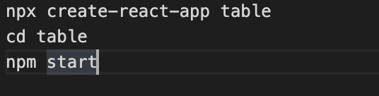
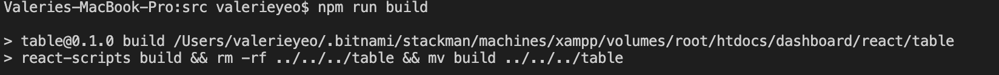
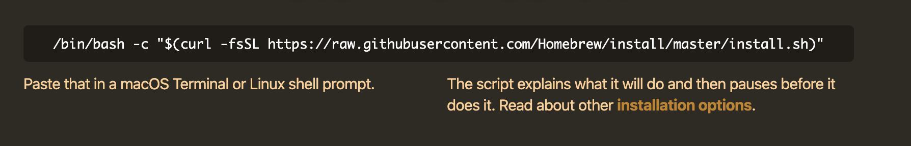
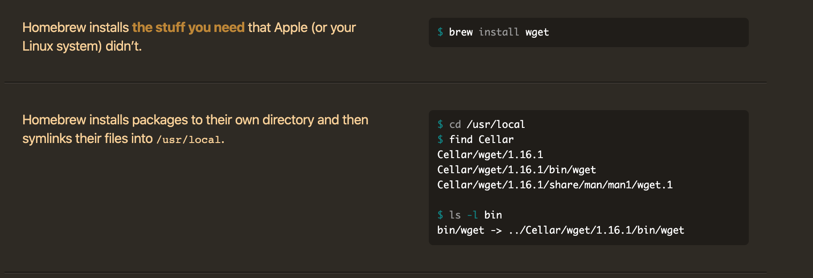

# JSWebDemo
JSWebDemo

<H2> Installation Steps </H2>

<H4> Operating System: MacOS </H4> 

<H4>XAMPP</H4>  
Website: https://www.apachefriends.org/index.html  

1. Start the XAMPP  
  

2. Start the required stack services  
  

3. Enable the port fowarding rules  
  

4. Click "Mount" to acess the "htdocs" folder in the directory  
  

  

<H4> Node.js</H4> 
Node.js and npm can be installed from Node installation page (https://nodejs.org/en/download/).  
Download the Node installer.  

Once the installation is done, you can test to see both node and npm functioning by opening Terminal (or any shell) and type node -v and npm -v, which will check the version number.

  
Use the <strong>npm init</strong> command to create a package.json file for your application.  
  

Install the following node.js modules for the backend Javascript codes (controller.js).  

<strong> express </strong>  
https://www.npmjs.com/package/express  
  

<strong> body-parser </strong>  
https://www.npmjs.com/package/body-parser  
  

<strong> urlencoded-parser </strong>  
https://www.npmjs.com/package/urlencoded-parser  
  

<strong> cors </strong>  
https://www.npmjs.com/package/cors  
  

<H4> React.js </H4>
Website: https://reactjs.org/docs/create-a-new-react-app.html

<strong> Key Creation Steps </strong>  

Please create a folder "react" first.  
Run the following commands  
  

Navigate to the path "dashboard/react/table/src"  
Open "App.js" at any IDE tool  
Write Reactjs Table codes in App.js  
Run <strong>"npm run build"</strong> command  
  
<strong> Note: </strong> "npm build" command change to "npm run build" command  

<H4> Homebrew MySQL </H4>
<strong> Install HomeBrew MySQL </strong>  
<strong> Website: </strong> https://brew.sh/ 

Run the following commands at Terminal (or any shell) to install Homebew MySQL. 
  
  
Set "user" as "root" and "password" as "root"  
<b> Note: </b> It is okay to set "root" for both user and password as this is just assessment.  

