# JSWebDemo
JSWebDemo

<H2> Installation Steps </H2>

<strong> Operating System: MacOS </strong>  

<strong>XAMPP</strong>  
Website: https://www.apachefriends.org/index.html  

1. Start the XAMPP  
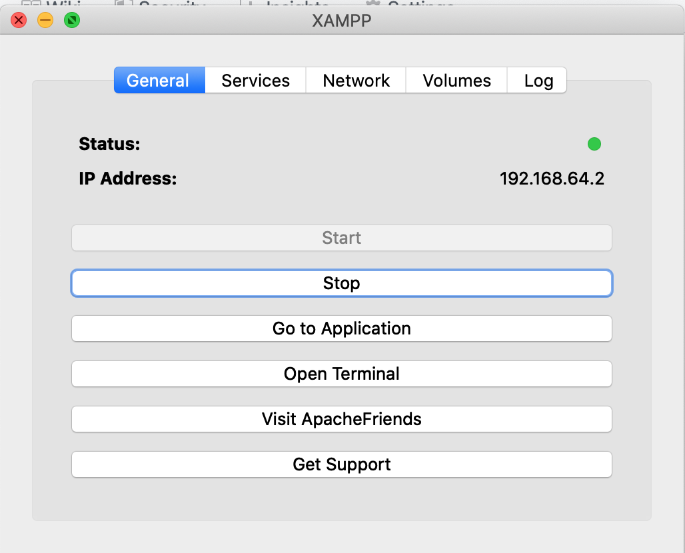  

2. Start the required stack services  
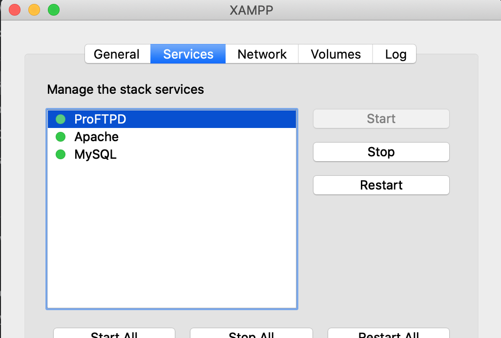  

3. Enable the port fowarding rules  
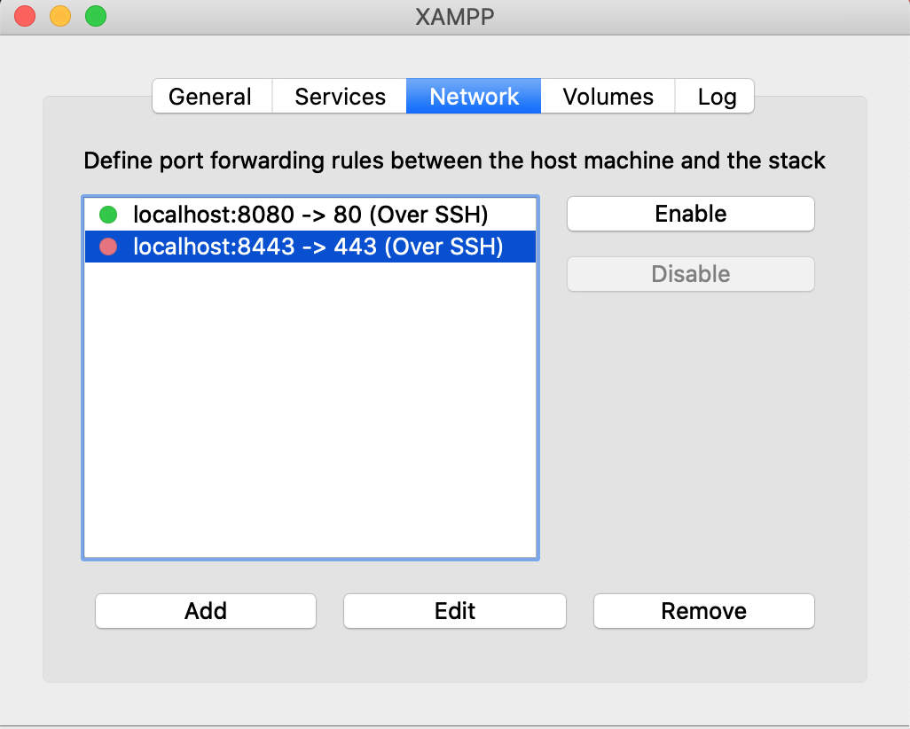  

4. Click "Mount" to acess the "htdocs" folder in the directory  
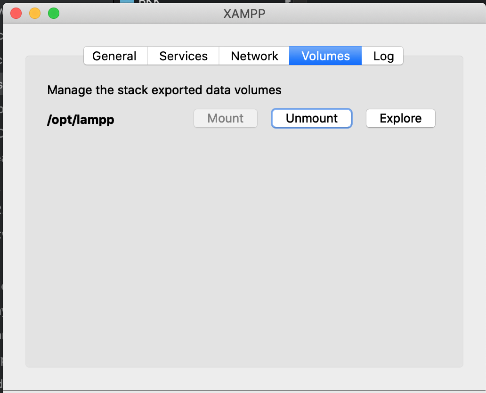  

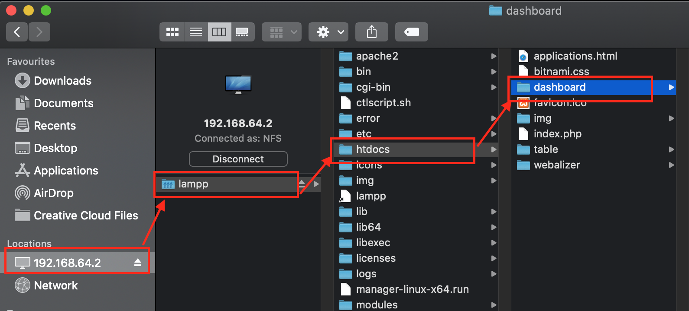  

Node.js and npm can be installed from Node installation page (https://nodejs.org/en/download/).  
Download the Node installer.  

Once the installation is done, you can test to see both node and npm functioning by opening Terminal (or any shell) and type node -v and npm -v, which will check the version number.

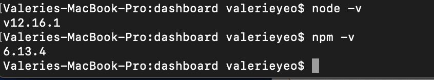  
Use the <strong>npm init</strong> command to create a package.json file for your application.  
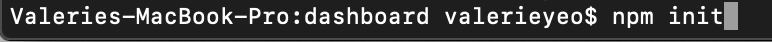  

Install the following node.js modules for the backend Javascript codes (controller.js).  

<strong> express </strong>  
https://www.npmjs.com/package/express  
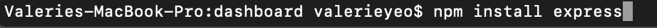  

<strong> body-parser </strong>  
https://www.npmjs.com/package/body-parser  
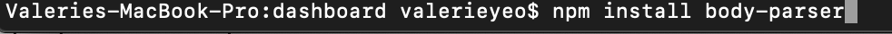  

<strong> urlencoded-parser </strong>  
https://www.npmjs.com/package/urlencoded-parser  
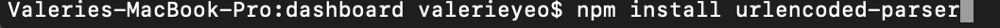  

<strong> cors </strong>  
https://www.npmjs.com/package/cors  
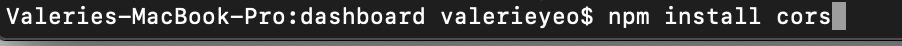  
